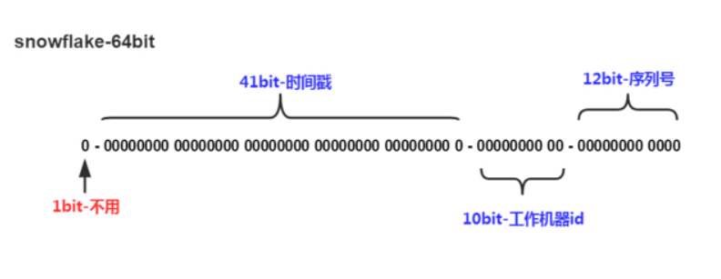

#### Snowflake 算法
- 分布式唯一ID
- 为了达到业务的幂等，必须要有这样一个id存在，需要满足下面几个条件：
  - 同一业务场景要全局唯一
  - 该id必须是在消息的发送方进行产生发送到MQ
  - 消费端根据该id进行判断是否重复，确保幂等
- Snowflake 构成
  - 
    ```
    SnowFlake的结构如下(每部分用-分开):
        0 - 0000000000 0000000000 0000000000 0000000000 0 - 00000 - 00000 - 000000000000
        1位标识，最高位是符号位，正数是0，负数是1，所以id一般是正数，最高位是0
        41位时间截(毫秒级)，注意，41位时间截不是存储当前时间的时间截，而是存储时间截的差值（当前时间截 - 开始时间截)
            这里的的开始时间截，一般是我们的id生成器开始使用的时间，由我们程序来指定的
            41位的时间截，可以使用69年，年T = (1L << 41) / (1000L * 60 * 60 * 24 * 365) = 69
        10位的数据机器位，可以部署在1024个节点，包括5位datacenterId和5位workerId
        12位序列，毫秒内的计数，12位的计数顺序号支持每个节点每毫秒(同一机器，同一时间截)产生4096个ID序号
            加起来刚好64位，为一个Long型
        SnowFlake的优点是，整体上按照时间自增排序，并且整个分布式系统内不会产生ID碰撞(由数据中心ID和机器ID作区分)，并且效率较高，经测试，SnowFlake每秒能够产生26万ID左右
    ```
#### 代码缺陷
- 非线程安全
- 需要加入分布式锁

#### 参考资料
- [分布式唯一id：snowflake算法思考](https://www.cnblogs.com/jiangxinlingdu/p/8440413.html)
- [Leaf——美团点评分布式ID生成系统](Leaf——美团点评分布式ID生成系统)
